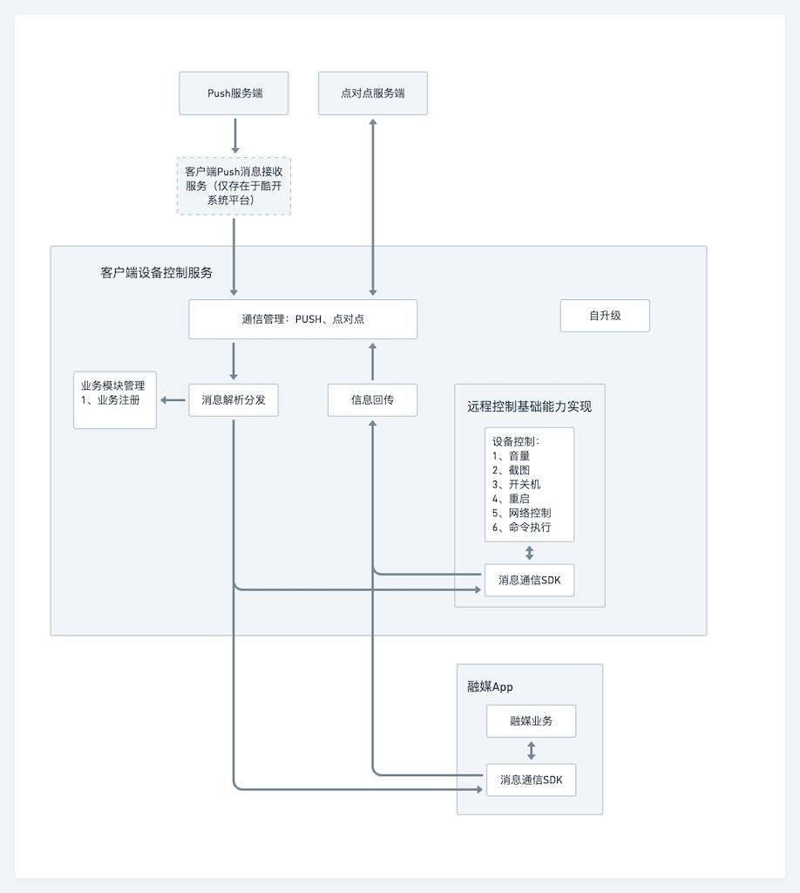

## 通用远程控制平台对接文档

### 方案架构



### SDK对接方法

#### 1、工程依赖SDK
SDK暂时以aar形式提供，放入libs文件夹，并在gradle文件中依赖：

```java
implementation fileTree(include: ['*.jar','*.aar'], dir: 'libs')
```

#### 2、配置服务
新建类继承自`AbsRemotePlatformClient`抽象类，实现抽象方法。接收到的消息内容，封装在`RemoteCommand.content`变量中。

```java
protected abstract void onNewMessage(RemoteCommand command);
```

在AndroidManifest.xml中配置上面新建的Service类：

```xml
    <!-- 增加这个权限 -->
    <uses-permission android:name="android.permission.FOREGROUND_SERVICE" />
    <application>
        <service
            android:name="your.service.class.name"
            android:exported="true">
            <meta-data
                android:name="id"
                android:value="your.package.name" />
            <intent-filter>
                <action android:name="coocaa.intent.action.remote.platform.client" />
            </intent-filter>
        </service>
    </application>
```

注意：  

+ `action`的值固定为`coocaa.intent.action.remote.platform.client`
+ `meta-data`中，`name`的值固定为`id`，`value`的值为接收消息的业务唯一id，建议用包名，用于区分消息分配给哪个业务处理。

#### 3、API使用

SDK初始化：

```java
RemotePlatform.getInstance().init(context);
```

接收消息：监听回调：

```java
onNewMessage(RemoteCommand command);
```

发送消息：

```java
RemotePlatform.getInstance().sendMessage(command);
```
注册状态回调：

```java
RemotePlatform.getInstance().registerEventHandler(callback);
```

#### 4、IRemoteCallback状态回调

与后台建立连接成功：

```java
onConnect()；
```
与后台连接断开：

```java
onDisconnect()；
```

执行客户端方法:  
该方法会被消息App调用，执行执行客户端方法，然后返回执行结果。

```java
Map<String, String> invokeClientMethod(String method, Map<String, String> params);
```

已有的回调方法：

`method`：`"isQuickKeyOpen"`，`params`：`null`，返回值：Map[`Constant.REMOTE_METHOD_RESULT_KEY`,`"true"/"false"`]

#### 5、注入激活ID和设备ID

融媒App需要把生成的激活ID和设备ID传给消息App，用于注册Push。

```java
Map<String, String> params = new HashMap<>();
params.put("activeId","xxx");
params.put("deviceId","xxx");
//调用SDK的工具方法
Utils.injectParams(context, params);
```

#### 6、消息执行结果
需要反馈消息执行情况给后端。

命令开始执行：

```java
command.replyProcessing(mContext).reply();
```

命令执行成功：

```java
command.replyFinish(mContext).reply();
```

命令执行失败：

```java
command.replyError(mContext).reply();
```

如果要附加更多的信息给后端，可以调用with的一系列方法：

```java
command.replyFinish(mContext)
	.withStatus(status)//自定义status
	.withMessage(msg)//自定义返回结果描述
	.withContent(content)//自定义返回的content字段
	.reply();//记得最后一定要调用reply()方法
```