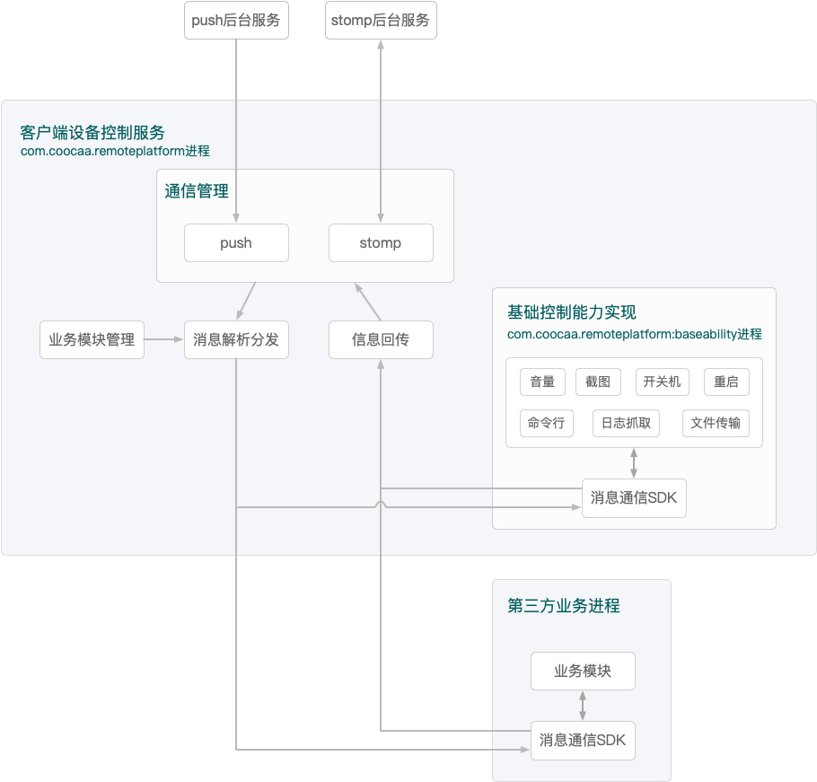

## 通用远程控制平台对接文档

### 方案架构


#### 1、方案整体架构组成

+ push服务后台：提供推送消息下发服务。
+ stomp服务后台：提供点对点socket通信服务。
+ 客户端设备控制服务：提供消息接收转发服务，提供基础的设备控制能力。
+ 第三方业务：提供业务相关功能。

#### 2、客户端设备控制服务模块

+ 通信管理：负责与后端建立连接，包括push和stomp。
+ 消息解析分发：负责从通信协议中解析消息内容，并转发给对应的接收模块。
+ 信息回传：负责反馈业务的消息执行情况以及传输业务产生的数据给后台。
+ 业务模块管理：负责查找、识别设备上已安装的消息处理模块（例如基础控制能力实现模块、第三方业务模块）。
+ 基础控制能力实现：提供基础的设备控制能力默认实现，独立进程运行。
+ 消息通信SDK：负责各业务模块与控制服务之间的跨进程通信。

#### 3、业务流程

+ 主进程开机自启或被业务进程拉起，随即建立push连接，并等待push消息。业务模块管理在进程启动时扫描已安装应用，缓存业务模块和对应的业务id。当主进程接收到push消息时，解析并根据push消息中的目标业务id，从业务管理模块中找到并发送。各业务模块从消息通信SDK的回调中取得后台下发的消息，解析并处理。
+ 消息送达、解析、处理的关键节点，以及消息处理的结果，通过信息回传模块上报服务端。
+ stomp点对点连接的建立，是后台通过push通知通信管理模块来开启。stomp点对点连接主要用于远程控制的消息下发，执行结果回传。

#### 4、设计原则

+ 职责单一：根据需求和技术选型，按照职责的不同，划分模块，相互配合运行，以实现高内聚低耦合。
+ 开闭原则：对修改关闭，对扩展开放。当新增业务模块时，只需要依赖消息通信SDK，以新增App或新增进程的方式扩展。对于新增的模块，无须修改原有设计架构。通用的消息封装，对于新增的消息定义，可灵活扩展。
+ 独立进程：消息的接收转发与消息的处理放置于不同进程中，可隔离消息处理实现时的崩溃问题，保证消息中枢的稳定。

### SDK对接方法

#### 1、工程依赖SDK
SDK暂时以aar形式提供，放入libs文件夹，并在gradle文件中依赖：

```java
implementation fileTree(include: ['*.jar','*.aar'], dir: 'libs')
```

#### 2、配置服务
新建类继承自`AbsRemotePlatformClient`抽象类，实现抽象方法。接收到的消息内容，封装在`RemoteCommand.content`变量中。

```java
protected abstract void onNewMessage(RemoteCommand command);
```

在AndroidManifest.xml中配置上面新建的Service类：

```xml
    <!-- 增加这个权限 -->
    <uses-permission android:name="android.permission.FOREGROUND_SERVICE" />
    <application>
        <service
            android:name="your.service.class.name"
            android:exported="true">
            <meta-data
                android:name="id"
                android:value="your.package.name" />
            <intent-filter>
                <action android:name="coocaa.intent.action.remote.platform.client" />
            </intent-filter>
        </service>
    </application>
```

注意：  

+ `action`的值固定为`coocaa.intent.action.remote.platform.client`
+ `meta-data`中，`name`的值固定为`id`，`value`的值为接收消息的业务唯一id，建议用包名，用于区分消息分配给哪个业务处理。

#### 3、API使用

SDK初始化：

```java
RemotePlatform.getInstance().init(context);
```

接收消息：监听回调：

```java
onNewMessage(RemoteCommand command);
```

发送消息：

```java
RemotePlatform.getInstance().sendMessage(command);
```
注册状态回调：

```java
RemotePlatform.getInstance().registerEventHandler(callback);
```

#### 4、IRemoteCallback状态回调

与后台建立连接成功：

```java
onConnect()；
```
与后台连接断开：

```java
onDisconnect()；
```

执行客户端方法:  
该方法会被消息App调用，执行执行客户端方法，然后返回执行结果。

```java
Map<String, String> invokeClientMethod(String method, Map<String, String> params);
```

已有的回调方法：

`method`：`"isQuickKeyOpen"`，`params`：`null`，返回值：Map[`Constant.REMOTE_METHOD_RESULT_KEY`,`"true"/"false"`]

#### 5、注入激活ID和设备ID

融媒App需要把生成的激活ID和设备ID传给消息App，用于注册Push。

```java
Map<String, String> params = new HashMap<>();
params.put("activeId","xxx");
params.put("deviceId","xxx");
//调用SDK的工具方法
Utils.injectParams(context, params);
```

#### 6、消息执行结果
需要反馈消息执行情况给后端。

命令开始执行：

```java
command.replyProcessing(mContext).reply();
```

命令执行成功：

```java
command.replyFinish(mContext).reply();
```

命令执行失败：

```java
command.replyError(mContext).reply();
```

如果要附加更多的信息给后端，可以调用with的一系列方法：

```java
command.replyFinish(mContext)
	.withStatus(status)//自定义status
	.withMessage(msg)//自定义返回结果描述
	.withContent(content)//自定义返回的content字段
	.reply();//记得最后一定要调用reply()方法
```